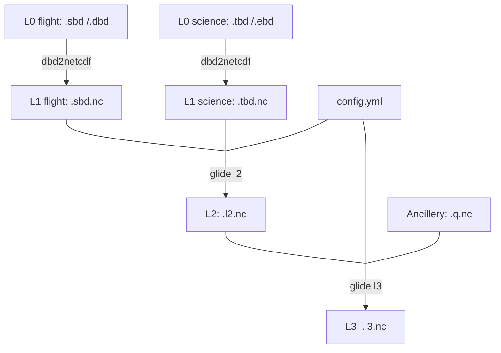

# glide

The Slocum underwater glider processing command line interface. 

`glide` produces quality controlled L2 and L3 datasets from real-time and delayed Slocum glider data. It can generate datasets that meet [IOOS Glider DAC](https://gliders.ioos.us/) standards. It requires that data are first converted to netCDF or csv using [`dbd2netcdf`](https://github.com/OSUGliders/dbd2netcdf) (or `dbd2csv`), a very fast Dinkum binary conversion tool.

Our definitions of data processing levels are guided by [NASA](https://www.earthdata.nasa.gov/learn/earth-observation-data-basics/data-processing-levels), the [Spray data](https://spraydata.ucsd.edu/data-access), and our own experiences working with gliders. We define the following levels:

* **L0**: Binary files produced by Slocum gliders include `.dbd`, `.sbd`, `.ebd`, `.tbd` or their compressed counterparts `.dcd`, ... etc. 
* **L1**: NetCDF or csv timeseries of flight and science data generated using `dbd2netcdf`. Usually named `glidername.dbd.nc` and `glidername.ebd.nc` or something similar. No quality control is performed. Data have the same units as in [masterdata](https://gliderfs.coas.oregonstate.edu/gliderweb/masterdata/).
* **L2**: Variable units are converted to oceanographic standards. Quality controls are applied. Some missing data are interpolated. Dead reckoned GPS positions are adjusted using surface GPS fixes; valid GPS fixes are also written on a dedicated `time_gps` dimension. Thermodynamic variables, such as potential density, are derived. Profiles are identified and tagged with `profile_id`. Depth-averaged velocity is reported on a `time_uv` dimension. Science and flight variables specified in the configuration file are merged into a single file.
* **L3**: The L2 data are binned in depth and separated into profiles. Ancillery datasets may be merged, such as MicroRider data processed using [`q2netcdf`](github.com/OSUGliders/q2netcdf).

We also provide the following intermediate processing outputs that may be useful for debugging issues:

* **L1B**: The L1 data are parsed and quality control is performed but science and flight data are not merged.

## Installation

glide is now published to PyPI and can be installed using pip.

```bash
pip install slocum-glide
```

Since this is primary a CLI tool, pipx may be preferred for system installation.

```bash
pipx install slocum-glide
```

Note that glide may be slow to run at first try because the environment has to be built.

## Usage



The expected processing pipeline is described by the chart above. `glide` requires a configuration file to properly process glider data. If you do not provide a file, the [default file](src/glide/assets/config.yml) will be used. The configuration file specifies which variables to extract from the L1 data and provides flags for unit conversion and quality controls. Variables that are not listed will not be extracted. A lot of the package functionality is documented in the configuration file and users are encourage to reivew it thoroughly. 

Assuming that you have already run `dbd2netcdf` over raw files (e.g. `dbd2netcdf -o glider.tbd.nc *.tbd`) you can apply the l2 processing to the flight and science data. 

```
glide l2 -o glidername.l2.nc glidername.sbd.nc glidername.tbd.nc 
```

In case the default configuration needs modification, you may output it and edit as needed. 

```
glide cfg -o my.config.yml
```

A custom configuration may then be specified as an argument.

```
glide l2 -o glidername.l2.nc -c my.config.yml glidername.sbd.nc glidername.tbd.nc
```

The two file arguments also accept shell-style glob patterns in quotes (`"..."`). `glide` will concatenate per-segment L1 files for you.

```
glide l2 -o glidername.l2.nc "glidername-*.sbd.nc" "glidername-*.tbd.nc"
```

Each flight file must have a science file with the same basename stem (e.g. `glider-2025-056-0-27.sbd.nc` pairs with `glider-2025-056-0-27.tbd.nc`); the command aborts on any unpaired file. Pass `--skip-unpaired` to drop unmatched files with a warning instead.

To perform level 3 processing with a specific bin size use the `-b` option. Note that binning is performed in depth, not pressure.  

```
glide l3 glidername.l2.nc -o glidername.l3.nc -c glidername.config.yml -b 10
```

To extract dead-reckoned location data to CSV or just the surface fixes use the `gps` subcommand.

```
glide gps glidername.l2.nc -o glidername.gps.csv  # dead-reckoned, interpolated position
glide gps glidername.l2.nc -o glidername.fixes.csv --fixes  # surface GPS fixes only
```

A flight model may be calibrated against L2 glider data resulting in variables such as angle of attack and through-water speed. Review the configuration yml for more details on the setup. 

```
glider flight -c my.config.yml -o glidername.flight.nc glidername.l2.nc
```

To view the help for the package, or a specific command, use:

```
glide --help
glide l2 --help
```

## Real-time workflow and national glider DAC

For real-time applications, especially the production of DAC files, `glide` is designed to be run on the **full concatenated dataset** for a deployment, not on individual segment files as they arrive. Re-running `glide l2` on real-time data is relatively cheap and fast. The re-run avoids gaps that arise when velocity, GPS, or other state is reported only at the next surfacing and also ensures consistent profile numbering. You can either pre-merge files with `dbd2netcdf` and pass the resulting single file to `glide l2`, or pass glob patterns directly to `glide l2`, as specified above.

### IOOS Glider DAC submission

Add `--ioos` to `glide l2` to additionally emit one NGDAC v2-compliant NetCDF file per profile (one descent or one ascent) into the given directory:

```
glide l2 glider.sbd.nc glider.tbd.nc -o glider.l2.nc \
    --ioos ./dac/ -g glidername -c glidername.config.yml
```

A profile is emitted only when its containing surface-to-surface segment has a finite depth-averaged velocity — i.e., the closing surfacing has reported. Profiles still awaiting that surfacing are skipped and will be emitted on a future re-run with more concatenated data. Existing files are skipped (the filename encodes the profile start time); pass `--force` to overwrite.

Per-deployment instrument metadata (CTD make/model/serial, calibration dates, etc.) goes in the `instruments:` section of `config.yml` and is placed as scalar variables in each profile file.

## Quality control

During L1 to L2 processing we:

* Drop missing or repeated timestamps.
* Check data are within `valid_min` and `valid_max` limits from the config.
* Interpolate missing dead-reckoned position and linearly adjust the dead-reckoned position to align with surface fixes.
* Identify behavioral states such as dive, climb, surface, and drift, and assign profile numbers. This relies on [profinder](github.com/oceancascades/profinder)
* Track per-variable QC flags (`*_qc`) for variables tagged `track_qc` in core.yml, including for variables interpolated across the science/flight merge.

We plan to implement more of the [standard IOOS QC methods](https://cdn.ioos.noaa.gov/media/2017/12/Manual-for-QC-of-Glider-Data_05_09_16.pdf) in the future.

## Contributing

Collaboration is highly encouraged, and contributions from the community are welcome. To ensure a productive and respectful development process, please follow these guidelines.

* Open an issue to describe the problem you're addressing or the feature you'd like to implement. Be as detailed as possible. Include relevant context, your motivation, and any initial ideas you may have.
* Fork the repository and begin working on a solution in a separate branch. 
* When ready, submit a pull request that references the related issue. Keep pull requests focused and limited to a single concern.
* Please ensure your code follows the existing style and structure of the project.
* Include tests, as appropriate.

## Development

This package is developed with [`uv`](https://github.com/astral-sh/uv). 

After cloning this repository, genereate the virtual environment:
```
uv sync
```

Run tests:
```
uv run pytest -v
```

Format code:
```
uv run ruff format src tests
uv run ruff check --select I --fix
```

Type checking:
```
uv run mypy src tests
``` 

Try out glide on the test data:
```
uv run glide --log-level=debug l2 tests/data/osu684.sbd.csv tests/data/osu684.tbd.csv
```

By default this will produce a file `slocum.l2.nc`. 

### Publishing 

Make sure to the bump the version appropriately.

```
uv version --bump <major/minor/patch>
```

Remove any existing distributions, build, and publish.

```
rm -rf dist
uv build
uvx twine upload dist/*
```