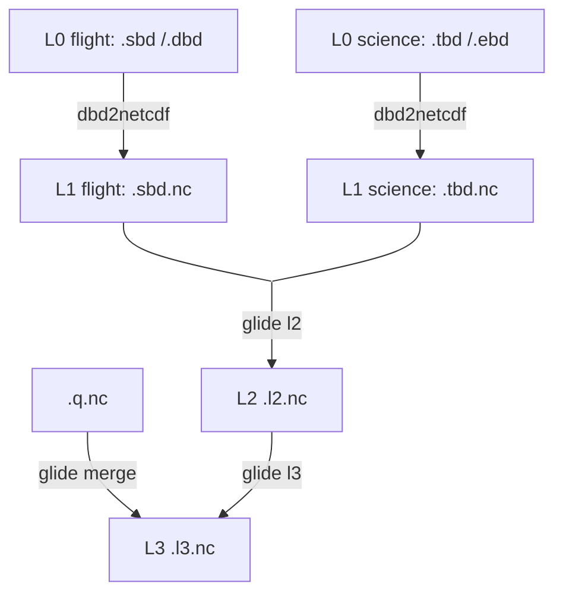

# glide

Slocum underwater glider processing command line interface. 

glide produces quality controlled L2 and L3 datasets from real-time and delayed-time Slocum glider data. It can generate datasets that meet [IOOS Glider DAC](https://gliders.ioos.us/) standards. It requires that data are first converted to netCDF or csv using [`dbd2netcdf`](github.com/OSUGliders/dbd2netcdf) (or `dbd2csv`), a very fast Dinkum binary conversion tool. Designed to be re-run on the full concatenated deployment dataset at every surfacing.

Our definitions of data processing levels are guided by [NASA](https://www.earthdata.nasa.gov/learn/earth-observation-data-basics/data-processing-levels), the [Spray data](https://spraydata.ucsd.edu/data-access), and our own experiences working with gliders. We define the following levels:

* **L0**: Binary files produced by Slocum gliders include `.dbd`, `.sbd`, `.ebd`, `.tbd` or their compressed counterparts `.dcd`, ... etc. 
* **L1**: NetCDF or csv timeseries of flight and science data generated using `dbd2netcdf`. Usually named `glidername.dbd.nc` and `glidername.ebd.nc` or something similar. No quality control is performed. Data have the same units as in masterdata.
* **L2**: Variable units are converted to oceanographic standards. Basic quality controls are applied. Some missing data are interpolated. Dead reckoned GPS positions are adjusted using surface GPS fixes; valid GPS fixes are also written on a dedicated `time_gps` dimension. Thermodynamic variables are derived. Profiles are identified and tagged with `profile_id`. Depth-averaged velocity is reported on a `time_uv` dimension. Science and flight variables specified in the configuration file are merged into a single file.
* **L3**: The L2 data are binned in depth and separated into profiles. Optionally, MicroRider data processed using [`q2netcdf`](github.com/OSUGliders/q2netcdf) may also be merged.

Additionally, we provide the following intermediate processing outputs that may be useful for debugging issues:

* **L1B**: The L1 data are parsed and basic quality control is performed but science and flight data are not merged.

## Real-time workflow note

`glide` is designed to be run on the **full concatenated dataset** for a deployment, not on individual segment files as they arrive. You can either pre-merge files with `dbd2netcdf` and pass the resulting single file to `glide l2`, or pass glob patterns directly to `glide l2` and let it concatenate the per-segment L1 files itself (every flight file must have a science file with the same basename stem).

Re-running `glide l2` on real-time data is cheap and idempotent — the recommended pattern is to re-concatenate and re-run after every surfacing. This avoids the gaps that arise when velocity, GPS, or other state is reported only at the next surfacing. It is especially important for DAC submission (`--ioos`), where per-profile files are only emitted once their depth-averaged velocity has been reported.

## Installation

Use pipx:

```bash
pipx install git+https://github.com/OSUGliders/glide
```

## Usage




`glide` requires a configuration file to properly process glider data. If you do not provide a file, the [default file](src/glide/assets/config.yml) will be used. The configuration file specifies which variables to extract from the L1 data and provides flags for unit conversion and quality controls. Variables that are not listed will not be extracted.

Assuming that you have already run `dbd2netcdf` over a directory of files (e.g. `dbd2netcdf -o glider.tbd.nc *.tbd`) you can apply the l2 processing using,


```
glide l2 glidername.sbd.nc glidername.tbd.nc -o glidername.l2.nc -c glidername.config.yml
```

The two file arguments also accept shell-style glob patterns, so you can let `glide` concatenate per-segment L1 files for you instead of pre-merging with `dbd2netcdf`:

```
glide l2 "glidername-*.sbd.nc" "glidername-*.tbd.nc" -o glidername.l2.nc
```

Quote the patterns to keep the shell from expanding them. Each flight file must have a science file with the same basename stem (e.g. `glider-2025-056-0-27.sbd.nc` pairs with `glider-2025-056-0-27.tbd.nc`); the command aborts on any unpaired file. Pass `--skip-unpaired` to drop unmatched files with a warning instead.

To perform level 3 processing with a specific bin size, use:

```
glide l3 glidername.l2.nc -o glidername.l3.nc -c glidername.config.yml -b 10
```

To view the help for the package, or a specific command, use:

```
glide --help
glide l2 --help
```

To create a hotel file

```
glide hot glidername.l2.nc -o glidername.hot.mat
```

To extract location data to CSV (interpolated, dense) or just the surface fixes (sparse, raw):

```
glide gps glidername.l2.nc -o glidername.gps.csv
glide gps glidername.l2.nc -o glidername.fixes.csv --fixes
```

### IOOS Glider DAC submission

Add `--ioos` to `glide l2` to additionally emit one NGDAC v2-compliant NetCDF file per profile (one descent or one ascent) into the given directory:

```
glide l2 glider.sbd.nc glider.tbd.nc -o glider.l2.nc \
    --ioos ./dac/ -g glidername -c glidername.config.yml
```

A profile is emitted only when its containing surface-to-surface segment has a finite depth-averaged velocity — i.e., the closing surfacing has reported. Profiles still awaiting that surfacing are skipped and will be emitted on a future re-run with more concatenated data. Existing files are skipped (the filename encodes the profile start time); pass `--force` to overwrite.

Per-deployment instrument metadata (CTD make/model/serial, calibration dates, etc.) goes in the `instruments:` section of `config.yml` and is emitted as scalar variables in each profile file.

## Quality control

During L1 → L2 processing we currently:

* Drop missing or repeated timestamps.
* Check data are within `valid_min` and `valid_max` limits from the config.
* Interpolate missing dead-reckoned position; linearly adjust between surface fixes.
* Identify dive/climb profiles from pressure, and assign surface state from GPS fix proximity.
* Track per-variable QC flags (`*_qc`) for variables tagged `track_qc` in core.yml, including for variables interpolated across the science/flight merge.

We plan to implement more of the [standard IOOS QC methods](https://cdn.ioos.noaa.gov/media/2017/12/Manual-for-QC-of-Glider-Data_05_09_16.pdf) in the future.

## Development

This package is developed with [`uv`](https://github.com/astral-sh/uv). 

After cloning this repository, genereate the virtual environment:
```
uv sync
```

Run tests:
```
uv run pytest -v
```

Format code:
```
uv run ruff format src tests
uv run ruff check --select I --fix
```

Type checking:
```
uv run mypy src tests
``` 

Try out glide on the test data:
```
uv run glide --log-level=debug l2 tests/data/osu684.sbd.csv tests/data/osu684.tbd.csv
```

By default this will produce a file `slocum.l2.nc`. 

## Contributing

Thank you for your interest in contributing to this project. Collaboration is highly encouraged, and contributions from the community are always welcome. To ensure a productive and respectful development process, please follow these guidelines.

Before submitting any code, please open an issue to describe the problem you're addressing or the feature you'd like to implement. This allows for discussion around the proposed changes, helps align efforts, and ensures that contributions are in line with the project's goals. When creating an issue, be as detailed as possible. Include relevant context, your motivation, and any initial ideas you may have.

Once an issue has been discussed and agreed upon, feel free to fork the repository and begin working on a solution in a separate branch. When you're ready, submit a pull request that references the related issue and clearly outlines the changes you've made. Try to keep your pull requests focused and limited to a single concern to make the review process smoother. Please ensure your code follows the existing style and structure of the project. If you're unsure about conventions or need guidance, don't hesitate to ask. Contributions should be well-tested.
